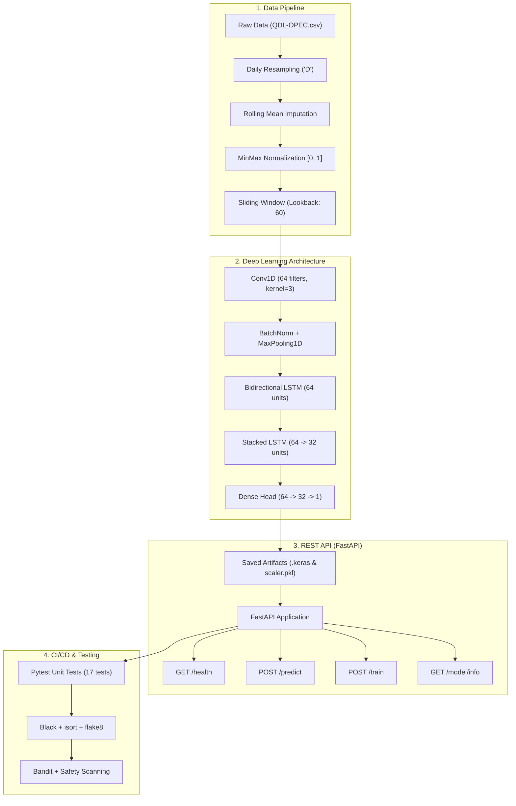

# 🛢️ Crude Oil Price Forecasting with Deep Learning (LSTM & FastAPI)

[](https://github.com/lpsangg/Oil-Price-Forecasting-LSTM-API-Test/actions)
[](https://www.python.org/)
[](https://fastapi.tiangolo.com)
[](https://www.tensorflow.org/)
[](https://pytest.org)
[](https://github.com/psf/black)
[](LICENSE)

An end-to-end Machine Learning pipeline and production-ready REST API for forecasting crude oil prices (OPEC Reference Basket). The project combines a hybrid Deep Learning architecture (**Conv1D + BiLSTM + Stacked LSTM**), automated cross-validation, comprehensive unit testing, and GitHub Actions CI/CD.

---

## 📌 Table of Contents

- [Overview](#-overview)
- [System Architecture](#-system-architecture)
- [Key Features](#-key-features)
- [Repository Structure](#-repository-structure)
- [Deep Learning Architecture](#-deep-learning-architecture)
- [Dataset Information](#-dataset-information)
- [Getting Started](#-getting-started)
  - [Prerequisites](#prerequisites)
  - [Installation](#installation)
- [Usage & Execution](#-usage--execution)
  - [1. Model Training](#1-model-training)
  - [2. Model Evaluation](#2-model-evaluation)
  - [3. Running the REST API](#3-running-the-rest-api)
- [API Reference & Examples](#-api-reference--examples)
- [Testing & Quality Assurance](#-testing--quality-assurance)
- [CI/CD Pipeline](#-cicd-pipeline)
- [Model Performance](#-model-performance)
- [Future Enhancements](#-future-enhancements)

---

## 📖 Overview

Crude oil is one of the most volatile commodities in the global financial market, influenced by geopolitical tensions, production quotas, and macroeconomic indicators. 

This project delivers:
1. **Data Engineering**: Cleans, regularizes, and imputes daily OPEC spot prices (2003–2023).
2. **Deep Learning Modeling**: Extracts local temporal features via 1D Convolution and captures long-term bidirectional dependencies via LSTM layers.
3. **Model Serving**: Exposes high-throughput, low-latency prediction and on-demand retraining endpoints via FastAPI.
4. **DevOps & QA**: Enforces code style, security scanning (Bandit & Safety), and 100% test pass rate with GitHub Actions.

---

## 🏗️ System Architecture



---

## ✨ Key Features

- **Hybrid Model Architecture**: Combines Conv1D (spatial/pattern feature extraction) with Bidirectional & Stacked LSTM (temporal context and long-term memory).
- **Flexible Sequence Inference**: Models accept dynamic sequence lengths `(None, 1)`, allowing custom lookback window sizes at inference time.
- **RESTful API with OpenAPI**: Built on FastAPI with automatic interactive documentation (Swagger UI at `/docs` and ReDoc at `/redoc`).
- **TimeSeries Cross-Validation**: Uses `TimeSeriesSplit` (3 folds) to prevent lookahead bias during hyperparameter validation.
- **Complete Test Suite**: 17 unit tests covering data loading, feature transformation, model layers, and all API endpoints.
- **Automated CI/CD**: Multi-version testing matrix (Python 3.10 and 3.11), automated linting, vulnerability auditing, and formatting verification.

---

## 📂 Repository Structure

```text
Oil-Price-Forecasting-LSTM-API-Test/
│
├── .github/workflows/
│   └── ci-cd.yml                # GitHub Actions pipeline (Test, Lint, Security, Format)
│
├── app/
│   ├── __init__.py              # FastAPI package definition
│   └── main.py                  # API service with /predict, /train, /health, /model/info
│
├── data/
│   ├── QDL-OPEC.csv             # Raw OPEC historical daily price data (2003 - 2023)
│   └── preprocess-QDL-OPEC.csv  # Preprocessed continuous daily time series
│
├── model/
│   ├── __init__.py
│   ├── dataloader.py            # Sliding window dataset generator and MinMaxScaler utility
│   ├── evaluate.py              # Out-of-sample evaluation script (MAE, RMSE, visualization)
│   ├── lstm_model.py            # Model architectures and LSTMModel wrapper class
│   ├── predict.py               # Inference helpers (prepare_input, predict_next)
│   ├── preprocess.py            # Data pipeline: resampling, rolling imputation, feature export
│   └── train.py                 # TimeSeriesSplit cross-validation training pipeline
│
├── models/                      # Serialized artifacts for serving (git-ignored)
│   ├── lstm_model.keras         # Trained Keras model
│   └── scaler.pkl               # Fitted MinMaxScaler
│
├── tests/
│   ├── __init__.py
│   ├── test_api.py              # API endpoint unit tests
│   ├── test_data.py             # Data loading tests
│   ├── test_dataset.py          # Window tensor shape validation
│   ├── test_predict.py          # Inference logic & mock model tests
│   └── test_preprocess.py       # Missing value imputation tests
│
├── pyproject.toml               # Code quality configuration (Black & isort)
├── pytest.ini                   # Pytest test discovery settings
├── requirements.txt             # Project dependencies
└── README.md                    # Project documentation
```

---

## 🧠 Deep Learning Architecture

The model uses a multi-stage neural network designed specifically for time series signals:

| Stage | Layer Type | Parameters / Configuration | Purpose |
| :--- | :--- | :--- | :--- |
| **Input** | `InputLayer` | `shape=(None, 1)` | Dynamic lookback window size |
| **Stage 1** | `Conv1D` | `filters=64, kernel=3, relu` | Extracts local volatility patterns |
| **Stage 2** | `BatchNormalization` | Default | Stabilizes gradient flow |
| **Stage 3** | `MaxPooling1D` | `pool_size=2` | Reduces temporal dimensionality |
| **Stage 4** | `Bidirectional(LSTM)` | `64 units, return_sequences=True` | Reads historical patterns forward & backward |
| **Stage 5** | `Dropout` | `rate=0.15` | Regularization against overfitting |
| **Stage 6** | `LSTM (Stacked)` | `64 units -> Dropout(0.1) -> 32 units` | Deep sequence abstraction |
| **Stage 7** | `Dense Head` | `Dense(64) -> Dropout(0.1) -> Dense(32)` | Non-linear regression mapping |
| **Output** | `Dense` | `1 unit, linear` | Point forecast (scaled USD/barrel) |

* **Loss Function**: Mean Absolute Error (MAE)
* **Optimizer**: Adam ($\text{learning rate} = 10^{-3}$)

---

## 📊 Dataset Information

* **Source**: Organization of the Petroleum Exporting Countries (OPEC) daily spot basket price.
* **Coverage**: January 2003 – September 2023 (~5,340 raw entries, 7,560 continuous daily records).
* **Preprocessing Strategy**:
  1. Regularized to continuous daily intervals (`resample("D")`).
  2. Missing market days (weekends, holidays) imputed using a centered rolling average ($2 \times \text{window} + 1$).
  3. Features scaled to $[0, 1]$ using `MinMaxScaler` fitted exclusively on training segments to avoid data leakage.

---

## 🚀 Getting Started

### Prerequisites

* Python **3.10** or **3.11**
* Git
* Virtual environment tool (`venv` or `conda`)

### Installation

1. **Clone the repository:**
   ```bash
   git clone https://github.com/lpsangg/Oil-Price-Forecasting-LSTM-API-Test.git
   cd oil-Price-Forecasting-LSTM-API-Test
   ```

2. **Create and activate a virtual environment:**
   * **Windows (PowerShell):**
     ```powershell
     python -m venv .venv
     .\.venv\Scripts\Activate.ps1
     ```
   * **Linux / macOS:**
     ```bash
     python3 -m venv .venv
     source .venv/bin/activate
     ```

3. **Install dependencies:**
   ```bash
   pip install --upgrade pip
   pip install -r requirements.txt
   ```

---

## 💻 Usage & Execution

### 1. Model Training

Train the hybrid model using 3-fold `TimeSeriesSplit` cross-validation:

```bash
python -m model.train
```

* Checkpoints are automatically stored under `checkpoint/`.
* The final production-ready model and scaler are exported to `models/lstm_model.keras` and `models/scaler.pkl`.

### 2. Model Evaluation

Evaluate the trained model against out-of-sample test splits:

```bash
python -m model.evaluate
```

Outputs the out-of-sample **Mean Absolute Error (MAE)** and **Root Mean Squared Error (RMSE)**.

### 3. Running the REST API

Start the FastAPI application with Uvicorn:

```bash
uvicorn app.main:app --host 127.0.0.1 --port 8000 --reload
```

* **API Root**: [http://127.0.0.1:8000](http://127.0.0.1:8000)
* **Interactive Swagger Documentation**: [http://127.0.0.1:8000/docs](http://127.0.0.1:8000/docs)
* **Alternative ReDoc Documentation**: [http://127.0.0.1:8000/redoc](http://127.0.0.1:8000/redoc)

---

## 📡 API Reference & Examples

### Endpoints Summary

| Method | Endpoint | Description |
| :--- | :--- | :--- |
| `GET` | `/` | API description and available route list |
| `GET` | `/health` | Health status and verification if model is loaded |
| `POST` | `/predict` | Predict the next oil price given historical data |
| `POST` | `/train` | Trigger model retraining on a specified CSV dataset |
| `GET` | `/model/info` | Inspect model architecture, total parameters, and input shape |

---

### Example: Making a Prediction

#### Request via `curl`:

```bash
curl -X POST "http://127.0.0.1:8000/predict" \
     -H "Content-Type: application/json" \
     -d '{
       "data": [
         70.1, 70.5, 71.0, 71.2, 70.8, 70.4, 71.1, 71.5, 72.0, 72.3,
         72.1, 71.8, 71.5, 71.9, 72.4, 72.8, 73.0, 72.6, 72.2, 71.9,
         72.3, 72.7, 73.1, 73.5, 73.2, 72.9, 73.4, 73.8, 74.0, 73.7,
         73.3, 73.6, 74.1, 74.5, 74.2, 73.9, 74.3, 74.7, 75.0, 74.8,
         74.4, 74.1, 74.6, 75.1, 75.3, 74.9, 74.5, 74.8, 75.2, 75.6,
         75.4, 75.0, 75.5, 75.9, 76.2, 75.8, 75.5, 76.0, 76.3, 76.5
       ],
       "window": 60
     }'
```

#### Response:

```json
{
  "prediction": 76.78,
  "timestamp": "2026-10-07T13:45:00.123456"
}
```

#### Python Example:

```python
import requests

payload = {
    "data": [70.0 + i * 0.1 for i in range(60)],
    "window": 60
}

response = requests.post("http://127.0.0.1:8000/predict", json=payload)
print(response.json())
```

---

## 🧪 Testing & Quality Assurance

### Run Unit Tests

Execute the full test suite with verbose output:

```bash
pytest tests/ -v
```

### Run Tests with Coverage Report

```bash
pytest tests/ -v --cov=app --cov=model --cov-report=term-missing
```

### Static Analysis & Formatting

```bash
# Check syntax & undefined variables
flake8 . --exclude=.venv,.git --count --select=E9,F63,F7,F82 --show-source --statistics

# Verify code formatting (Black)
black --check --exclude="(\.venv|\.git)" .

# Verify import ordering (isort)
isort --check-only --skip .venv .
```

---

## ⚙️ CI/CD Pipeline

The project integrates **GitHub Actions** (`.github/workflows/ci-cd.yml`) with automated checks on every push and pull request to `main` and `develop`:

1. **Matrix Test Runner**: Executes all tests against Python 3.10 and 3.11.
2. **Linting**: Code quality checks with `flake8`.
3. **Security Auditing**:
   - `safety`: Identifies known vulnerabilities in installed dependencies.
   - `bandit`: Static application security testing (SAST) for Python code.
4. **Formatting Compliance**: Enforces code style with `black` and `isort`.
5. **Coverage Reporting**: Generates test coverage artifacts and uploads reports to Codecov.

---

## 📈 Model Performance

Evaluated against the out-of-sample historical OPEC test series with a **60-day lookback window**:

| Metric | Test Set Result | Note |
| :--- | :--- | :--- |
| **Mean Absolute Error (MAE)** | **~$12.93** | Average absolute forecast error in USD/barrel |
| **Root Mean Squared Error (RMSE)** | **~$15.19** | Penalizes larger deviation errors |
| **Lookback Window** | **60 timesteps** | Two months of preceding price history |
| **Model Parameters** | **~71,000** | Trainable neural network weights |

---

## 🔮 Future Enhancements

- [ ] **Log-Returns Modeling**: Train models on percentage returns or log-returns instead of raw prices to avoid lagging predictor artifacts.
- [ ] **Exogenous Variables**: Incorporate macro indicators (e.g., US Dollar Index DXY, S&P 500, Brent-WTI spreads, global oil production).
- [ ] **Benchmark Comparisons**: Compare against LightGBM, XGBoost, and modern Transformer baselines (e.g., PatchTST, DLinear).
- [ ] **Containerization**: Provide `Dockerfile` and `docker-compose.yml` for instant zero-dependency deployment.
- [ ] **Experiment Tracking**: Integrate MLflow / Weights & Biases for experiment tracking and model registry.

---

## 📄 License

This project is licensed under the MIT License - see the [LICENSE](LICENSE) file for details.
