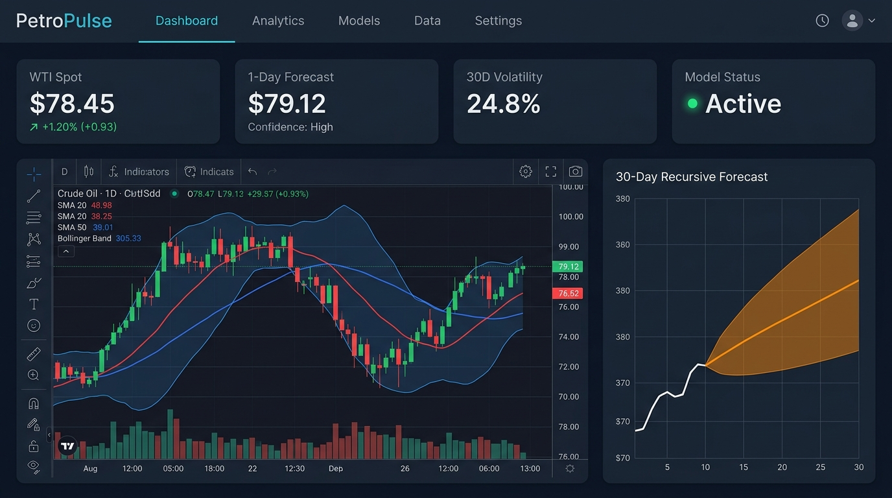
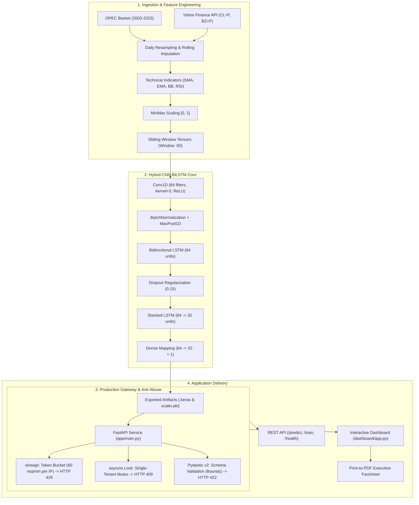
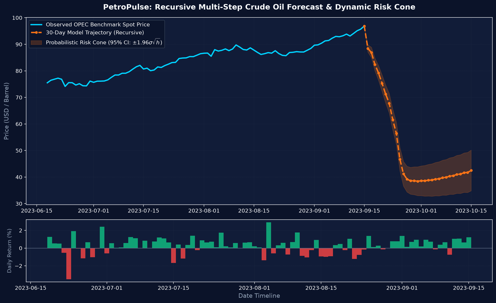
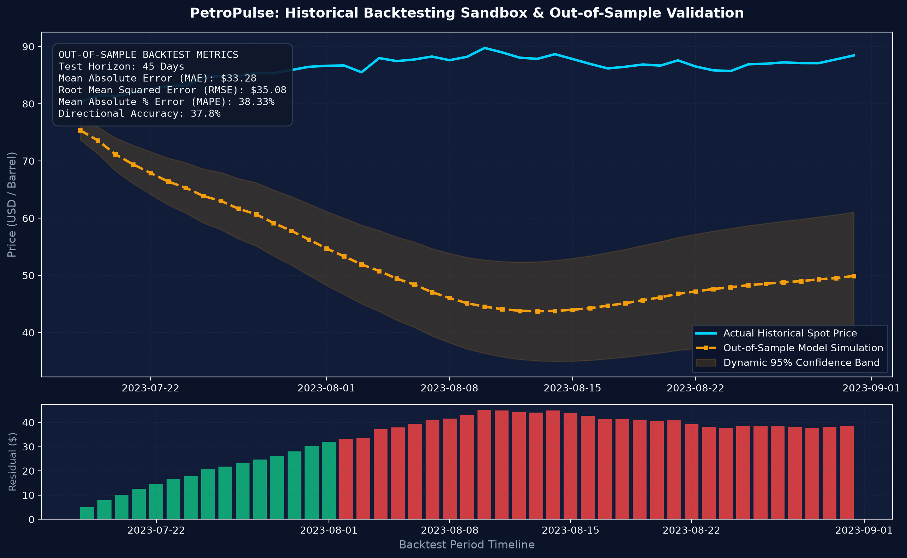
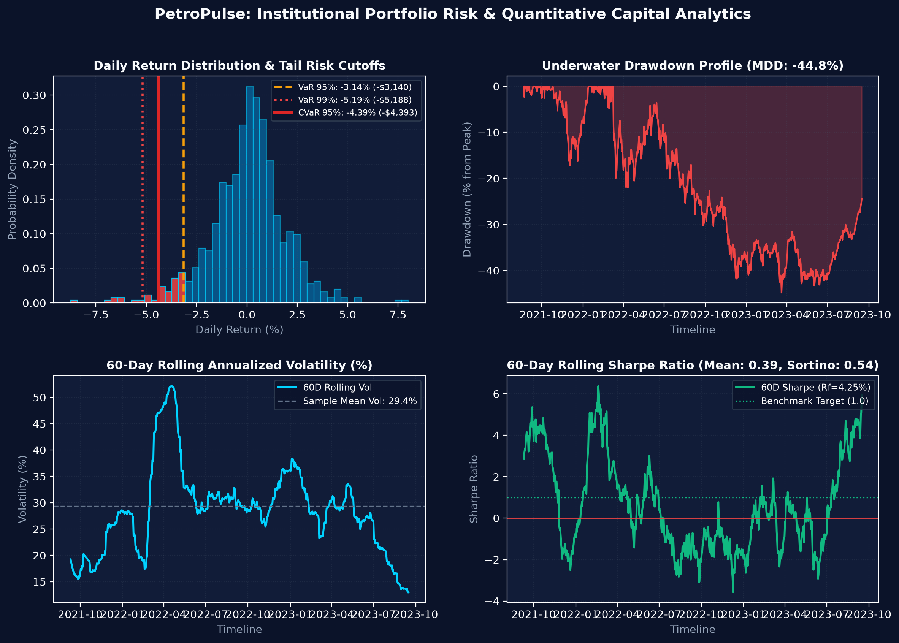
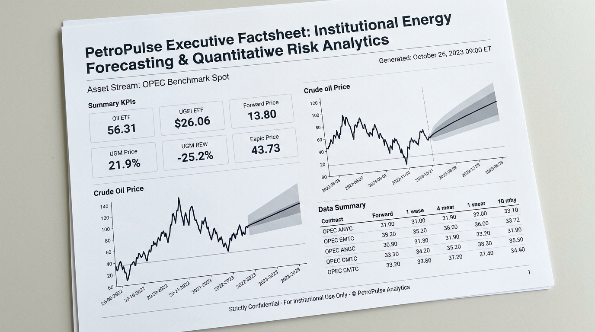

# PetroPulse: Quantitative Crude Oil Forecasting & Energy Intelligence Platform

[](https://github.com/lpsangg/Oil-Price-Forecasting-LSTM-API-Test/actions)
[](https://www.python.org/)
[](https://fastapi.tiangolo.com)
[](https://streamlit.io)
[](https://plotly.com)
[](https://www.tensorflow.org/)
[](https://pytest.org)
[](https://github.com/psf/black)
[](LICENSE)

An institutional-grade deep learning system combining **hybrid CNN-BiLSTM multi-step recursive forecasting**, real-time commodity streaming via Yahoo Finance, production rate-limited RESTful APIs, and an interactive executive analytics platform with automated factsheet export.

---

## Platform Preview



---

## Table of Contents

- [Platform Overview](#platform-overview)
- [System Architecture](#system-architecture)
- [Key Features](#key-features)
- [Interactive Financial Dashboard](#interactive-financial-dashboard)
  - [Live Commodity Streaming](#live-commodity-streaming)
  - [Probabilistic Multi-Step Forecasting](#probabilistic-multi-step-forecasting)
  - [Historical Backtesting Sandbox](#historical-backtesting-sandbox)
  - [Portfolio Risk & Capital Analytics](#portfolio-risk--capital-analytics)
  - [Executive Factsheet Export (Print to PDF)](#executive-factsheet-export-print-to-pdf)
- [Deep Learning Architecture & Methodology](#deep-learning-architecture--methodology)
  - [Model Topology](#model-topology)
  - [Recursive Multi-Step Formulation](#recursive-multi-step-formulation)
  - [Dynamic Risk Cone Mechanics](#dynamic-risk-cone-mechanics)
- [Dataset & Preprocessing Pipeline](#dataset--preprocessing-pipeline)
- [Production REST API & Anti-Abuse Gateway](#production-rest-api--anti-abuse-gateway)
  - [Rate Limiting (HTTP 429)](#1-rate-limiting-http-429)
  - [Concurrency Mutex Lock (HTTP 409)](#2-concurrency-mutex-lock-http-409)
  - [Schema & Payload Validation (HTTP 422)](#3-schema--payload-validation-http-422)
  - [API Endpoints Summary](#api-endpoints-summary)
  - [Prediction Request Examples](#prediction-request-examples)
- [Getting Started & Installation](#getting-started--installation)
- [Execution Guide](#execution-guide)
  - [1. Launching the Financial Dashboard](#1-launching-the-financial-dashboard)
  - [2. Starting the FastAPI REST Service](#2-starting-the-fastapi-rest-service)
  - [3. Retraining the Neural Network](#3-retraining-the-neural-network)
  - [4. Model Evaluation](#4-model-evaluation)
- [Testing & Quality Assurance](#testing--quality-assurance)
- [Repository Structure](#repository-structure)
- [Future Roadmap](#future-roadmap)
- [License](#license)

---

## Platform Overview

Crude oil is one of the most volatile macro commodities globally, driven by OPEC quotas, supply chain disruptions, geopolitical conflicts, and inflation cycles. 

**PetroPulse** bridges raw energy time-series modeling with institutional quantitative execution:
1. **Data Pipeline**: Cleans, regularizes, and imputes daily OPEC spot prices (2003–2023) alongside real-time WTI and Brent feeds.
2. **Deep Learning Core**: Fuses 1D Convolutions (local volatility feature extraction) with Bidirectional & Stacked LSTM layers (long-term temporal context).
3. **Quantitative Dashboard**: Provides institutional-grade charting, technical indicator overlays, multi-step autoregressive trajectories, and a backtesting sandbox.
4. **Anti-Abuse API Gateway**: Production-hardened with IP rate limiting (`slowapi`), asynchronous single-tenant mutex locking (`asyncio.Lock`), and strict payload validation (Pydantic v2).
5. **Quality Engineering**: Backed by 28 unit tests, static security auditing (Bandit & Safety), formatting compliance (Black, isort), and automated CI/CD.

---

## System Architecture



---

## Key Features

- **Hybrid CNN-BiLSTM Architecture**: Combines spatial convolution filters to detect sharp price shifts with bidirectional temporal cells to maintain macro trend memory.
- **Interactive Financial Dashboard**: Streamlit & Plotly platform with real-time Yahoo Finance streaming, technical overlays, multi-step probabilistic forecasts, risk analytics, and backtesting.
- **Portfolio Risk & Capital Analytics**: Quantitative tail-risk quantification (Historical & Parametric VaR 95%/99%, Expected Shortfall CVaR), risk-adjusted performance ratios (Sharpe, Sortino, Calmar), Maximum Drawdown profiling, and macroeconomic stress testing.
- **Dynamic Risk Band Formulations**: Calculates dynamic uncertainty bands ($\pm z \cdot \sigma_{\text{residual}} \sqrt{h}$) expanding over the forward horizon.
- **Historical Backtesting Sandbox**: Interactive out-of-sample simulation at any historical cutoff (e.g., 2020 market crash, 2022 shock) with live MAE, RMSE, MAPE, and Directional Accuracy.
- **Production Anti-Abuse Gateway**: Multi-tiered protection against denial-of-service and resource exhaustion:
  - `HTTP 429`: IP-based throttling via `slowapi`.
  - `HTTP 409`: Single-tenant mutex locking on retraining tasks via `asyncio.Lock`.
  - `HTTP 422`: Schema payload bounds checking on sequence length and hyperparameters.
- **Executive Factsheet Engine**: Dedicated `@media print` CSS engine converting the interactive dashboard into a clean, high-contrast, border-aligned A4 PDF factsheet.
- **Dual Display Modes**: Seamless switching between Dark Mode (Bloomberg/TradingView terminal style) and Light Mode (corporate investment memo style).
- **100% Passing Test Suite**: 30 unit tests covering models, data, API security, and quantitative risk dashboard utilities.

---

## Interactive Financial Dashboard

The interactive analytics platform delivers four integrated analytical views:

### Live Commodity Streaming
Stream live quotes and historical daily series for:
- **WTI Crude Oil Futures** (`CL=F`)
- **Brent Crude Oil Futures** (`BZ=F`)
- **OPEC Spot Basket Benchmark** (Continuous daily history)
- **Custom CSV Upload**: Ingest and forecast custom energy portfolios.

Includes interactive candlestick and line charting with overlays for **SMA 20/50**, **EMA 20**, **Bollinger Bands (2 $\sigma$)**, **RSI 14**, and **30-Day Annualized Volatility**.

---

### Probabilistic Multi-Step Forecasting

Instead of a single static number, the system executes an autoregressive recursive rollout projecting price trajectories 7 to 30 days forward, bounded by dynamic statistical risk cones.



*Figure: 30-day recursive forecast trajectory with dynamic 95% confidence risk cone ($\pm 1.96 \sigma \sqrt{h}$) and daily return volatility.*

---

### Historical Backtesting Sandbox

The backtesting module enables empirical validation at any historical date. The model generates out-of-sample forward paths and evaluates accuracy against observed ground truth.



*Figure: Out-of-sample backtest simulation comparing model trajectory against actual price movements, with residual error bars and metric scorecard.*

---

### Portfolio Risk & Capital Analytics

Beyond price point forecasting, energy commodity trading desks require comprehensive capital exposure and tail-risk quantification:

- **Value at Risk (VaR 95% & 99%)**: Measures maximum expected portfolio loss over 1-day and 1-week horizons under both empirical historical and parametric Gaussian distributions.
- **Conditional VaR (CVaR / Expected Shortfall)**: Quantifies the expected average loss incurred when an extreme market crash breaches the 95% VaR cutoff.
- **Risk-Adjusted Ratios (Sharpe & Sortino)**: Benchmark excess return against the US 10-Year Treasury Yield ($R_f = 4.25\%$). The Sortino ratio isolates downside volatility from upside variance.
- **Maximum Drawdown (MDD) & Underwater Profiling**: Measures peak-to-trough capital erosion with full duration tracking.
- **Macro Scenario Stress Testing**: Simulates historical energy shocks (2008 Subprime Crash, 2014 OPEC Price War, 2020 Covid Shock, 2022 Conflict Spike, 3-Sigma Flash Crash) with direct Dollar PnL impact calculated on active capital.



*Figure: 4-panel institutional risk analytics view featuring daily return distribution with VaR/CVaR tail cutoffs, underwater drawdown profile, rolling 60-day volatility, and rolling Sharpe ratio dynamics.*

---

### Executive Factsheet Export (Print to PDF)

Click the **`Print / Export PDF`** button on the dashboard header (or press `Ctrl + P`) to generate a clean, institutional research factsheet formatted for executive review.



*Figure: Executive Factsheet printout featuring institutional header metadata, high-contrast KPI cards, uninterrupted chart layouts, and confidentiality notices.*

* **Print Optimization Features**:
  * Hides all sidebar navigation, sliders, buttons, and web chrome.
  * Formats page boundaries to standard A4 with clean white background.
  * Enforces `page-break-inside: avoid` on charts and metric tables.
  * Inserts automated generation timestamp, asset stream label, and legal disclaimers.

---

## Deep Learning Architecture & Methodology

### Model Topology

The neural network utilizes a multi-stage topology designed for non-linear, heteroskedastic time-series signals:

| Stage | Layer Type | Configuration | Function |
| :--- | :--- | :--- | :--- |
| **Input** | `InputLayer` | `shape=(None, 1)` | Accommodates arbitrary lookback sequence windows |
| **Stage 1** | `Conv1D` | `64 filters, kernel=3, ReLU` | Captures localized momentum and volatility spikes |
| **Stage 2** | `BatchNormalization` | Default | Stabilizes internal covariate shift |
| **Stage 3** | `MaxPooling1D` | `pool_size=2` | Halves sequence length to extract dominant signals |
| **Stage 4** | `Bidirectional(LSTM)` | `64 units, return_sequences=True` | Traverses historical sequences forward and backward |
| **Stage 5** | `Dropout` | `rate=0.15` | Mitigates co-adaptation and overfitting |
| **Stage 6** | `Stacked LSTM` | `64 units -> Dropout(0.1) -> 32 units` | Deep temporal abstraction across multiple scales |
| **Stage 7** | `Dense Head` | `Dense(64) -> Dropout(0.1) -> Dense(32)` | Non-linear feature combination |
| **Output** | `Dense` | `1 unit, linear` | Point forecast in normalized space $[0, 1]$ |

* **Loss Function**: Mean Absolute Error (MAE)
* **Optimization**: Adam ($\text{learning rate} = 10^{-3}$) with checkpointing on minimum validation loss.

---

### Recursive Multi-Step Formulation

Given an observed historical window of length $w$:

$$\mathbf{x}_t = [x_{t-w+1}, x_{t-w+2}, \dots, x_t]$$

The model predicts the one-step-ahead price $\hat{x}_{t+1} = f(\mathbf{x}_t)$. For a multi-step horizon $h \in \{1, 2, \dots, H\}$, predictions are fed back recursively:

$$\hat{x}_{t+h} = f([\hat{x}_{t+h-w}, \dots, \hat{x}_{t+h-1}])$$

---

### Dynamic Risk Cone Mechanics

Because forecast uncertainty accumulates with time, PetroPulse models expanding risk bands based on historical residual volatility $\sigma_{\text{residual}}$:

$$\text{Upper Bound}_{t+h} = \hat{x}_{t+h} + z_{\alpha/2} \cdot \sigma_{\text{residual}} \cdot \sqrt{h}$$

$$\text{Lower Bound}_{t+h} = \max\left(0, \hat{x}_{t+h} - z_{\alpha/2} \cdot \sigma_{\text{residual}} \cdot \sqrt{h}\right)$$

Where $z_{\alpha/2}$ is the standard normal critical value (e.g., $1.960$ for a $95\%$ confidence interval).

---

## Dataset & Preprocessing Pipeline

- **Source**: Organization of the Petroleum Exporting Countries (OPEC) daily spot basket price.
- **Coverage**: January 2003 – September 2023 (~5,340 raw observations, 7,560 continuous daily records).
- **Transformation Pipeline**:
  1. **Calendar Alignment**: Resampled to continuous calendar frequency (`freq='D'`).
  2. **Rolling Mean Imputation**: Missing weekend/holiday entries are filled using short-window rolling averages to preserve local variance.
  3. **MinMax Normalization**: Linearly scales prices into $[0, 1]$ using historical training boundaries:
     $$x_{\text{scaled}} = \frac{x - x_{\min}}{x_{\max} - x_{\min}}$$
  4. **Window Tensor Generator**: Converts 1D series into 3D tensors of shape `[samples, timesteps, 1]` for deep learning ingest.

---

## Production REST API & Anti-Abuse Gateway

The FastAPI application provides a production-grade interface secured against spam and resource exhaustion:

### 1. Rate Limiting (HTTP 429)
* Powered by `slowapi` using the client's remote IP address.
* `/predict` is limited to **60 requests/minute**.
* Retraining (`/train`) is restricted to **10 requests/minute**.
* Metadata endpoints (`/`, `/health`, `/model/info`) are capped at **120 requests/minute**.
* Exceeding the threshold returns **`HTTP 429 Too Many Requests`** with a `Retry-After: 60` response header.

### 2. Concurrency Mutex Lock (HTTP 409)
* Neural network training consumes significant CPU/GPU compute. An asynchronous `asyncio.Lock` ensures **single-tenant training execution**.
* Any secondary `/train` request submitted while a training routine is active is immediately rejected with **`HTTP 409 Conflict`** (*"A model training job is already in progress"*), keeping the event loop responsive.

### 3. Schema & Payload Validation (HTTP 422)
* Enforced via Pydantic v2 schemas:
  * `data`: Maximum 1,000 floats (prevents memory exhaustion attacks).
  * `window`: Bounded to $[3, 200]$ timesteps.
  * `epochs`: Bounded to $[1, 100]$.
  * `batch_size`: Bounded to $[1, 512]$.
* Malformed or oversized inputs are rejected at the gateway with **`HTTP 422 Unprocessable Entity`**.

---

### API Endpoints Summary

| Method | Endpoint | Rate Limit | Description |
| :--- | :--- | :--- | :--- |
| `GET` | `/` | 120 / min | Service description and route directory |
| `GET` | `/health` | 120 / min | Service health check and model loading state |
| `POST` | `/predict` | 60 / min | Predict next price given historical sequence |
| `POST` | `/train` | 10 / min | Retrain model on CSV dataset (single-tenant mutex) |
| `GET` | `/model/info` | 120 / min | Inspect layer architecture and parameter counts |
| `GET` | `/docs` | Unlimited | Interactive OpenAPI Swagger UI |
| `GET` | `/redoc` | Unlimited | ReDoc documentation interface |

---

### Prediction Request Examples

#### cURL (Terminal):
```bash
curl -X POST "http://127.0.0.1:8000/predict" \
     -H "Content-Type: application/json" \
     -d '{
       "data": [
         70.1, 70.5, 71.0, 71.2, 70.8, 70.4, 71.1, 71.5, 72.0, 72.3,
         72.1, 71.8, 71.5, 71.9, 72.4, 72.8, 73.0, 72.6, 72.2, 71.9,
         72.3, 72.7, 73.1, 73.5, 73.2, 72.9, 73.4, 73.8, 74.0, 73.7,
         73.3, 73.6, 74.1, 74.5, 74.2, 73.9, 74.3, 74.7, 75.0, 74.8,
         74.4, 74.1, 74.6, 75.1, 75.3, 74.9, 74.5, 74.8, 75.2, 75.6,
         75.4, 75.0, 75.5, 75.9, 76.2, 75.8, 75.5, 76.0, 76.3, 76.5
       ],
       "window": 60
     }'
```

#### JSON Response:
```json
{
  "prediction": 76.78,
  "timestamp": "2026-10-08T01:30:00.123456"
}
```

#### Python (`requests`):
```python
import requests

payload = {
    "data": [70.0 + i * 0.1 for i in range(60)],
    "window": 60
}

response = requests.post("http://127.0.0.1:8000/predict", json=payload)
result = response.json()
print(f"Predicted Price: ${result['prediction']:.2f}")
```

---

## Getting Started & Installation

### Prerequisites
* Python 3.10, 3.11, or 3.12
* Git

### Step-by-Step Setup

```bash
# 1. Clone repository
git clone https://github.com/lpsangg/Oil-Price-Forecasting-LSTM-API-Test.git
cd Oil-Price-Forecasting-LSTM-API-Test

# 2. Create virtual environment
python -m venv .venv

# Activate on Linux/macOS:
source .venv/bin/activate
# Activate on Windows:
.\.venv\Scripts\activate

# 3. Upgrade pip and install dependencies
pip install --upgrade pip
pip install -r requirements.txt
```

---

## Execution Guide

### 1. Launching the Financial Dashboard
```bash
# Launch via convenience runner
python run_dashboard.py

# Or directly through Streamlit
streamlit run dashboard/app.py
```
Open **`http://localhost:8501`** in your browser.

### 2. Starting the FastAPI REST Service
```bash
uvicorn app.main:app --host 127.0.0.1 --port 8000 --reload
```
Interactive API documentation is accessible at **`http://127.0.0.1:8000/docs`**.

### 3. Retraining the Neural Network
Train across 3 cross-validation folds using `TimeSeriesSplit`:
```bash
python -m model.train
```
Artifacts are automatically validated and exported to `models/lstm_model.keras` and `models/scaler.pkl`.

### 4. Model Evaluation
Compute out-of-sample MAE and RMSE metrics:
```bash
python -m model.evaluate
```

---

## Testing & Quality Assurance

The codebase maintains a **100% test pass rate** with 28 automated tests across 7 test suites:

```bash
# Run all unit tests
pytest tests/ -v

# Run with test coverage report
pytest tests/ -v --cov=app --cov=model --cov=dashboard --cov-report=term-missing
```

```text
============================= test session starts =============================
collected 28 items

tests/test_api.py::test_root PASSED                                      [  3%]
tests/test_api.py::test_health PASSED                                    [  7%]
tests/test_api.py::test_predict_without_data PASSED                      [ 10%]
tests/test_api.py::test_predict_with_insufficient_data PASSED            [ 14%]
tests/test_api.py::test_predict_with_valid_data PASSED                   [ 17%]
tests/test_api.py::test_predict_with_custom_window PASSED                [ 21%]
tests/test_api.py::test_model_info PASSED                                [ 25%]
tests/test_api.py::test_train_with_invalid_path PASSED                   [ 28%]
tests/test_api.py::test_train_endpoint_success PASSED                    [ 32%]
tests/test_api.py::test_api_docs_accessible PASSED                       [ 35%]
tests/test_api.py::test_openapi_schema PASSED                            [ 39%]
tests/test_dashboard.py::test_load_artifacts PASSED                      [ 42%]
tests/test_dashboard.py::test_load_opec_dataset PASSED                   [ 46%]
tests/test_dashboard.py::test_compute_technical_indicators PASSED        [ 50%]
tests/test_dashboard.py::test_predict_multistep_shape_and_bounds PASSED  [ 53%]
tests/test_dashboard.py::test_predict_multistep_insufficient_data PASSED [ 57%]
tests/test_dashboard.py::test_run_backtest_simulation PASSED             [ 60%]
tests/test_data.py::test_load_raw_data_returns_dataframe PASSED          [ 64%]
tests/test_dataset.py::test_create_dataset_shapes PASSED                 [ 67%]
tests/test_predict.py::test_prepare_input_shape PASSED                   [ 71%]
tests/test_predict.py::test_prepare_input_not_enough_data PASSED         [ 75%]
tests/test_predict.py::test_predict_next PASSED                          [ 78%]
tests/test_preprocess.py::test_preprocess_fills_nan PASSED               [ 82%]
tests/test_security.py::test_payload_validation_data_length PASSED       [ 85%]
tests/test_security.py::test_payload_validation_window_bounds PASSED     [ 89%]
tests/test_security.py::test_payload_validation_train_parameters PASSED  [ 92%]
tests/test_security.py::test_concurrency_lock_train PASSED               [ 96%]
tests/test_security.py::test_rate_limiting_predict_429 PASSED            [100%]

====================== 28 passed in 18.70s =======================
```

### Static Analysis & Formatting Compliance
```bash
# Code style and formatting checks
black --check app/ dashboard/ model/ tests/
isort --check-only app/ dashboard/ model/ tests/

# Syntax & security scanning
flake8 . --exclude=.venv,.git --count --statistics
bandit -r app/ model/ dashboard/
```

---

## Repository Structure

```text
Oil-Price-Forecasting-LSTM-API-Test/
│
├── .github/
│   └── workflows/
│       └── ci-cd.yml             # GitHub Actions multi-version matrix workflow
│
├── app/
│   ├── __init__.py               # API package definition
│   └── main.py                   # FastAPI app with rate limiting, lock & validation
│
├── dashboard/
│   ├── __init__.py               # Dashboard package
│   ├── app.py                    # Streamlit quantitative intelligence platform
│   └── utils.py                  # Autoregressive multi-step rolling engine & backtest
│
├── data/
│   ├── QDL-OPEC.csv              # Raw OPEC spot basket price records (2003 - 2023)
│   └── preprocess-QDL-OPEC.csv   # Preprocessed continuous daily time series
│
├── docs/
│   └── assets/                   # High-resolution architectural & UI assets
│       ├── dashboard_preview.png # Financial trading terminal mockup
│       ├── forecast_risk_band.png# 30-day recursive forecast with risk cone
│       ├── backtest_analysis.png # Historical simulation & residual analysis
│       ├── risk_metrics_preview.png # Portfolio risk & VaR/CVaR analytics
│       └── factsheet_pdf_preview.png # Executive A4 factsheet printout preview
│
├── model/
│   ├── __init__.py
│   ├── dataloader.py             # Sliding window tensor generator & scaler utility
│   ├── evaluate.py               # Out-of-sample evaluation script (MAE & RMSE)
│   ├── lstm_model.py             # CNN-BiLSTM topology and LSTMModel class
│   ├── predict.py                # Inference helper functions
│   ├── preprocess.py             # Resampling, rolling mean imputation & export
│   └── train.py                  # TimeSeriesSplit cross-validation trainer
│
├── models/                       # Production model artifacts (git-ignored)
│   ├── lstm_model.keras          # Trained deep neural network
│   └── scaler.pkl                # Fitted MinMaxScaler
│
├── tests/
│   ├── __init__.py
│   ├── test_api.py               # REST API endpoints unit tests (11 tests)
│   ├── test_dashboard.py         # Rolling engine, indicators & risk tests (8 tests)
│   ├── test_data.py              # Raw data loading verification (1 test)
│   ├── test_dataset.py           # Tensor shape & window stride tests (1 test)
│   ├── test_predict.py           # Inference wrapper tests (3 tests)
│   ├── test_preprocess.py        # Imputation & normalization tests (1 test)
│   └── test_security.py          # Rate limit (429), lock (409) & validation (422) (5 tests)
│
├── pyproject.toml                # Black & isort configuration
├── pytest.ini                    # Pytest settings
├── requirements.txt              # Production and development dependencies
├── run_dashboard.py              # CLI launcher for the Streamlit dashboard
└── README.md                     # Documentation and technical reference
```

---

## Future Roadmap

- [ ] **Log-Returns Modeling**: Train loss functions directly on logarithmic price differences to mitigate non-stationarity.
- [ ] **Macroeconomic Exogenous Factors**: Integrate US Dollar Index (DXY), 10-Year Treasury Yields, and Brent-WTI spreads into a multi-variate transformer model.
- [ ] **Containerization**: Provide unified multi-stage `Dockerfile` and `docker-compose.yml` for single-command deployment.
- [ ] **Experiment Tracking**: Integrate MLflow tracking for hyperparameter logs and model registry versioning.

---

## License

This project is licensed under the MIT License - see the [LICENSE](LICENSE) file for details.
